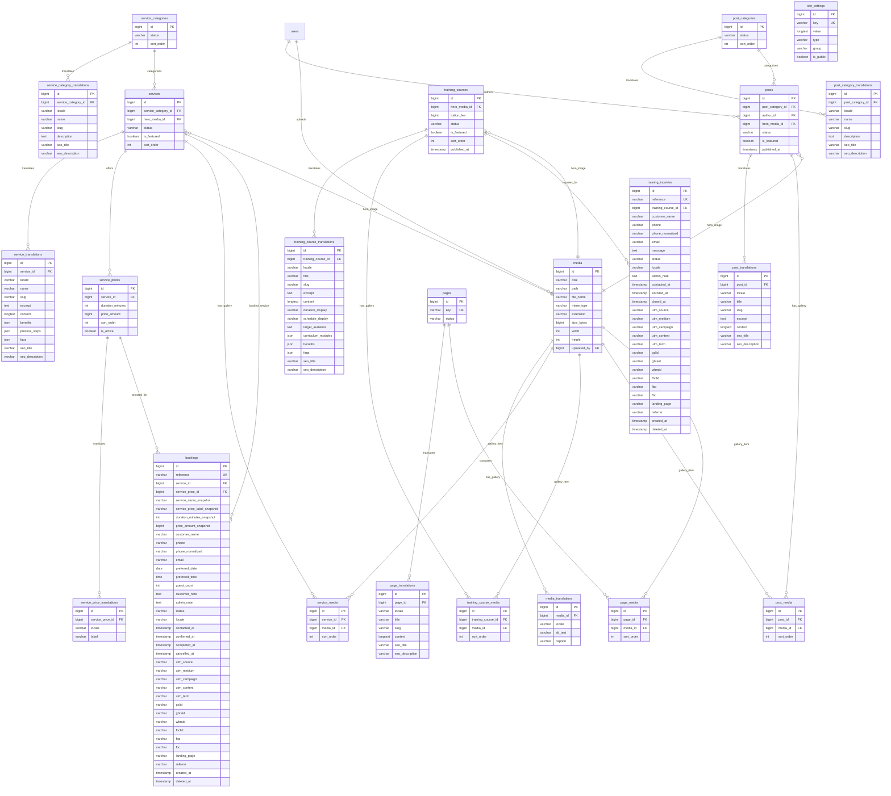

# DATABASE ENTITY RELATIONSHIP DIAGRAM (ERD)

**Project:** Việt Hàn Âu Hàn Spa (`viethanauhanspa.com`)  
**Phase:** Phase 1A — Domain Model & Database Architecture Design (Closure Patch)  
**Status:** ACCEPTED (Architect-Approved)  

---

