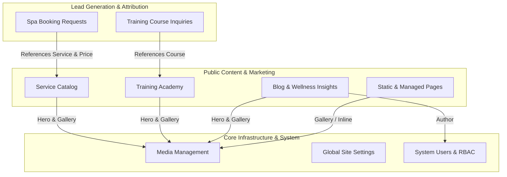
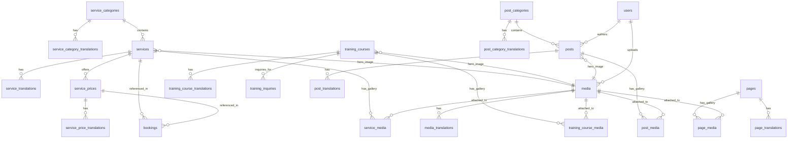

# DOMAIN MODEL SPECIFICATION

**Project:** Việt Hàn Âu Hàn Spa (`viethanauhanspa.com`)  
**Phase:** Phase 1A — Domain Model & Database Architecture Design (Closure Patch)  
**Status:** ACCEPTED (Architect-Approved)  

---

## 1. Domain Overview & Bounded Contexts

Việt Hàn Âu Hàn Spa operates as a luxury wellness spa and beauty training academy in Vietnam. The digital platform serves as a high-converting marketing, content, and lead-generation portal.

The domain is partitioned into 7 cohesive Bounded Contexts spanning **23 business entities**:

---

## 2. Bounded Context Entity Details

### 2.1 Service Catalog Context (`Services` — 7 Tables)
* **ServiceCategory**: Logical grouping of treatments (e.g., Body Massage, Facial Care, Foot Bath, Combos).
* **ServiceCategoryTranslation**: Localized category name, slug, description, and SEO metadata.
* **Service**: Individual wellness treatment offering with category reference and optional hero image.
* **ServiceTranslation**: Localized treatment name, slug, excerpt, rich HTML content, and structured editorial JSON (benefits, procedure steps, FAQs).
* **ServicePrice**: Discrete duration & pricing tiers (e.g., 60 mins / 390,000 VND; 90 mins / 490,000 VND).
* **ServicePriceTranslation**: Optional localized package title/label (e.g., "Gói Chuyên Sâu" / "Deep Treatment Package").
* **ServiceMedia**: Explicit relational pivot for multi-image service treatment galleries.

### 2.2 Training Academy Context (`Training` — 4 Tables)
* **TrainingCourse**: Professional beauty/massage certification course with tuition fee and optional hero image.
* **TrainingCourseTranslation**: Localized course title, slug, excerpt, content, duration/schedule display, and structured editorial JSON (curriculum modules, benefits, FAQs).
* **TrainingCourseMedia**: Explicit relational pivot for academy facility and certificate galleries.
* **TrainingInquiry**: Direct lead inquiry capturing student contact details, target course, inquiry message, and marketing attribution snapshot. Protected with `SoftDeletes`.

### 2.3 Blog & Insights Context (`Blog` — 5 Tables)
* **PostCategory**: Thematic grouping for articles (e.g., Skincare Tips, Health & Nutrition, Academy News).
* **PostCategoryTranslation**: Localized category name, slug, summary, and SEO metadata.
* **Post**: Editorial publication with scheduled publishing capability, author reference, and optional hero image.
* **PostTranslation**: Localized article title, slug, excerpt, rich HTML content, and SEO metadata.
* **PostMedia**: Explicit relational pivot for article image galleries and editorial attachments.

### 2.4 Page Management Context (`Pages` — 3 Tables)
* **Page**: Structural representation of key landing pages via fixed keys (`home`, `about`, `contact`, plus optional future keys like `terms`, `privacy`).
* **PageTranslation**: Localized page titles, slugs (NULL for homepage), rich content, and SEO metadata.
* **PageMedia**: Explicit relational pivot for page banner/facility galleries.

### 2.5 Media Management Context (`Media` — 2 Tables)
* **Media**: Central asset registry tracking physical files stored on disk (paths, MIME types, file dimensions, byte sizes).
* **MediaTranslation**: Localized accessibility and SEO attributes (`alt_text`, `caption`).

### 2.6 Lead Generation & Marketing Attribution Context (`Bookings` — 1 Table)
* **Booking**: Spa appointment request capturing customer preferences (service, pricing tier, preferred date, preferred time, guest count, contact info).
* **Historical Snapshots**: Preserves submission-time commercial truth (`service_name_snapshot`, `service_price_label_snapshot`, `duration_minutes_snapshot`, `price_amount_snapshot`).
* **Attribution Snapshot**: Point-in-time capture of UTM campaign parameters and ad click IDs (`gclid`, `fbclid`, etc.) attached directly to the lead. Protected with `SoftDeletes`.

### 2.7 Configuration Context (`Settings` — 1 Table)
* **SiteSetting**: Grouped key-value runtime configuration (`general`, `contact`, `social`, `tracking`). Secure by default (`is_public = false`).

---

## 3. Complete Domain Entity Relationships

